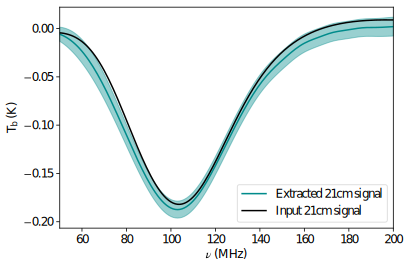

# SAVED21cm
A global 21cm signal extraction pipeline

In the evolutionary history of the universe, Cosmic Dawn (CD) and Epoch of Reionization (EoR) are the two crucial missing chapters. This is the period when the first sources of light in the universe were formed which in turn heated up and reionized the universe. 21cm line of atomic hydrogen is the most promising probe to study these epochs. Motivated by this a large number of experiments are ongoing across the world to detect this signal. However, in order to achieve a successful detection, a number of challenges need to be properly addressed. These challenges include the presence of bright foregrounds (4-6 orders of magnitude larger than the signal), the chromatic response of the antenna, presense of RFI and ionospheric distortions. Among these challenges, the most important one is remove the strong beam weighted foregrounds. This is because the beam of the antenna corrupts the spectrally smooth foregrounds thereby making it impossible to model them with the polynomials (which have been widely used throughout the literature).

This is a global 21cm signal extraction pipeline, specifically build for the REACH experiment, but in principle can be utilized for any global 21cm experiment. Our formalism is based on a pattern recognition framework using the Singular Value Decomposition (SVD) of the 21cm and foreground training set. It allows us to find the patterns in the training sets and properly model the chromatic distortions with a better basis than the polynomials. In the figure below, we show the extraction of the 21cm signal from a simulated mock observation, following this formalism. 

  

